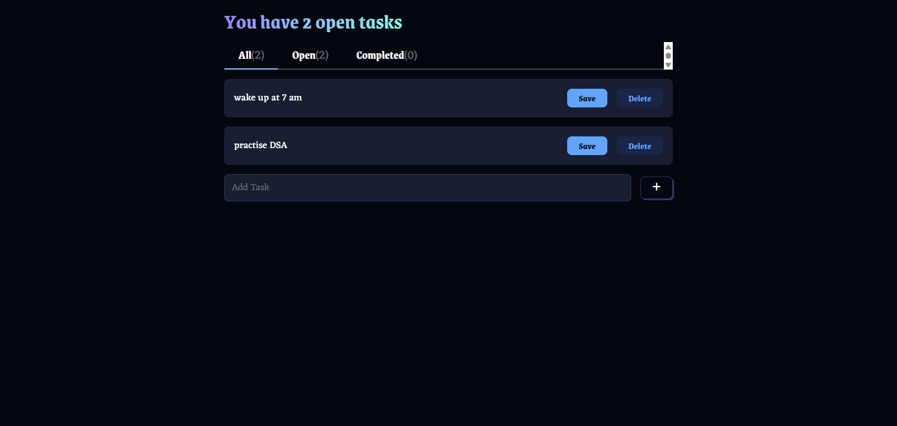

# 📝 Todo App

A beginner-friendly Todo application built with **React.js**, styled using **Fanta CSS**, and utilizing **Local Storage** for data persistence.

🔗 [Live Demo](https://beginner-friendly-todo-app.netlify.app)

---

## 📌 Features

- Add, edit, and delete tasks seamlessly  
- Mark tasks as completed or pending  
- Persistent data storage using the browser's Local Storage  
- Responsive and clean UI with Fanta CSS  
- Real-time updates without page reloads  

---

## 🚀 Getting Started

### Prerequisites

- Node.js (v14 or above)  
- npm or yarn package manager  

### Installation

1. **Clone the repository:**
   ```bash
   git clone https://github.com/SnigdhaDatta/todo-app.git
2. **Navigate to the project directory:**
   ```bash
   cd todo-app
   ```

3. **Install dependencies:**
   ```bash
   npm install
   # or
   yarn install
   ```

4. **Start the development server:**
   ```bash
   npm run dev
   # or
   yarn dev
   ```

5. **Open your browser and visit:**
   *The local Host that will come in your terminal*

---

## 🛠️ Technologies Used

- [React.js](https://reactjs.org/)
- [Fanta CSS](https://fantacss.com/)
- [Vite](https://vitejs.dev/)
- HTML5 & CSS3
- JavaScript (ES6+)

---

## 📁 Project Structure

```
todo-app/
├── public/
│   └── index.html
├── src/
│   ├── components/
│   │   └── TodoItem.jsx
│   ├── App.jsx
│   ├── main.jsx
│   └── styles/
│       └── styles.css
├── package.json
├── vite.config.js
└── README.md
```

---

## 📸 Screenshots
Desktop version



Mobile Version

---

## 🙌 Acknowledgements

- [Fanta CSS](https://fantacss.com/) for the styling framework  
- [Vite](https://vitejs.dev/) for the build tool  
- React community for extensive resources and support  

---

## 📄 License

This project is licensed under the [MIT License](LICENSE).
## 📬 Contact

Developed with ❤️ by **[Snigdha Datta](https://github.com/SnigdhaDatta)**  
If you have questions or suggestions, feel free to reach out via [LinkedIn](https://www.linkedin.com/in/snigdha-datta/) or open an issue on this repo.

---

## 🚀 Deployment

### 📦 Deploy with Netlify

1. Push your code to GitHub
2. Go to [Netlify](https://netlify.com)
3. Click **"New site from Git"**
4. Connect your GitHub repo
5. Select branch and use the following build settings:
   - **Build command:** `npm run build`
   - **Publish directory:** `dist`
6. Deploy 🚀

### 📦 Deploy with GitHub Pages (optional for Vite)

If using GitHub Pages with Vite, install the plugin:

```bash
npm install --save-dev vite-plugin-gh-pages
```

Or configure manually in `vite.config.js` and deploy with a script like `gh-pages`.

---
